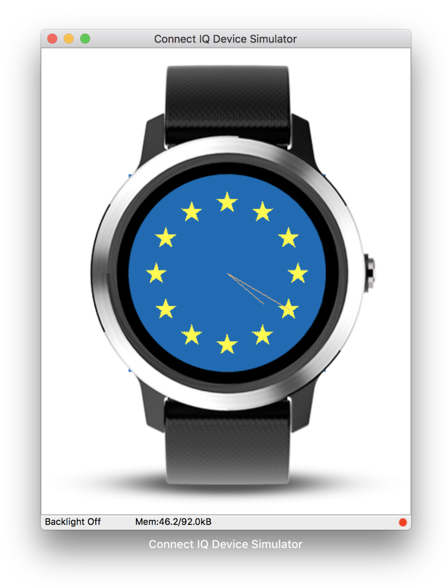

# EC Watchface

This is a weekend project made for fun playing with [monkeyc](https://developer.garmin.com/connect-iq/monkey-c/) and [Connect IQ SDK](https://developer.garmin.com/connect-iq/sdk/).

## Features

For the moment, there is only an analog clock display for rounded watches:

Later, maybe there will be some displayed metrics for distance, battery, etc., though for the moment I managed to place the most important parts: the clock hands and the stars.
